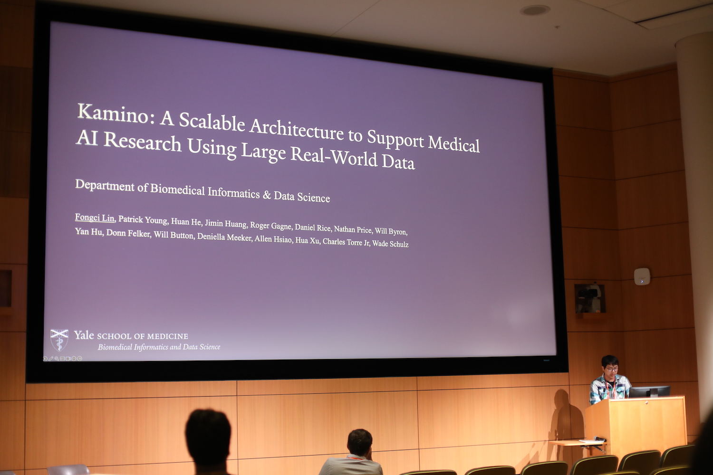

Title: Dr. Lin's work won the Best Paper Award in the Industry Track at IEEE ICHI 2024!
Category: news
Date: 2024-06-14
Slug: dr-lin-ieee-ichi-2024-kamino
Tags: NLP,LLM,GPT,ICHI,Best Paper,System
Summary: Dr. Lin presented the work, **"Kamino: A Scalable Architecture to Support Medical AI Research Using Large Real World Data"**, at the 12th IEEE International Conference on Healthcare Informatics (ICHI 2024), Orlando, Florida (June 3rd - 6th, 2024) and won the **Best Paper Award** in the Industry Track.

We are thrilled to announce that Dr. Raja presented a talk entitled **"Kamino: A Scalable Architecture to Support Medical AI Research Using Large Real World Data"** at the 12th IEEE International Conference on Healthcare Informatics (ICHI 2024), Orlando, Florida (June 3rd - 6th, 2024) and won the **Best Paper Award** in the Industry Track!

 
 

## Abstract
Electronic Health Records (EHRs) represent a crucial data source for real-world evidence generation. To facilitate biomedical studies using EHRs, standard data models like the OMOP CDM have been developed. 

Nevertheless, recent advancements in biomedical AI research that leverage EHRs have introduced new challenges, encompassing security considerations, large-scale data retrieval, and computational resource management, including GPUs. This paper introduces Kamino, an innovative architectural solution tailored to support biomedical AI research using EHR data. Kamino offers a userfriendly interface with features designed for efficient team access management in accordance with regulatory requirements. It facilitates direct data retrieval from an OMOP CDM instance and includes a resource allocation system based on Kubernetes orchestration. 

Here, we demonstrate the practical application and utility of Kamino through a clinical natural language processing task. We firmly believe that such a tool will significantly expedite AI research conducted with EHR data within academic institutions.

The link to the full paper in IEEE Xplorer will be updated when available.
