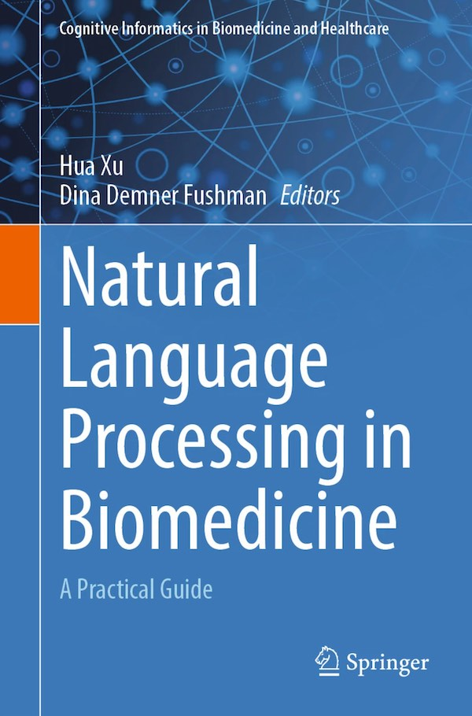

Title: Exciting New Book Release: "Natural Language Processing in Biomedicine: A Practical Guide" by Dr. Hua Xu
Category: news
Date: 2024-06-18
Slug: 20240618-nlp-book
Tags: NLP,LLM,GPT,Biomedicine
Summary: We are excited to announce the publication of a new textbook co-edited by Dr. Hua Xu and Dina Demner Fushman, titled **"Natural Language Processing in Biomedicine: A Practical Guide."**

We are thrilled to announce the publication of a new textbook co-edited by Dr. Hua Xu and Dina Demner Fushman, titled "Natural Language Processing in Biomedicine: A Practical Guide." More details can be found at: 

 

https://link.springer.com/book/10.1007/978-3-031-55865-8

### Overview

- Editors: Hua Xu, Dina Demner Fushman
- Unique Features: 
    - Coherent design with chapters covering NLP methods, systems, and applications.
    - Pedagogical features including learning objectives, glossaries, references, key readings, and example questions.
    - Schematics and illustrations to explain key points.

### About

This textbook covers broad topics within the application of natural language processing (NLP) in biomedicine, and provides in-depth review of the NLP solutions that reveal information embedded in biomedical text. The need for biomedical NLP research and development has grown rapidly in the past two decades as an important field in cognitive informatics.
 
Natural Language Processing in Biomedicine: A Practical Guide introduces the history of the biomedical NLP field and takes the reader through the basic aspects of NLP including different levels of linguistic information and widely used machine learning and deep learning algorithms. The book details common biomedical NLP tasks, such as named entity recognition, concept normalization, relation extraction, text classification, information retrieval, and question answering. The book illustrates the tasks with real-life use cases and introduces real-world datasets, novel machine learning and deep learning algorithms, and large language models. Relevant resources for corpora and medical terminologies are also introduced. The final chapters are devoted to discussing applications of biomedical NLP in healthcare and life sciences. This textbook therefore represents essential reading for students in biomedical informatics programs, as well as for professionals who are conducting research or building biomedical NLP systems.

