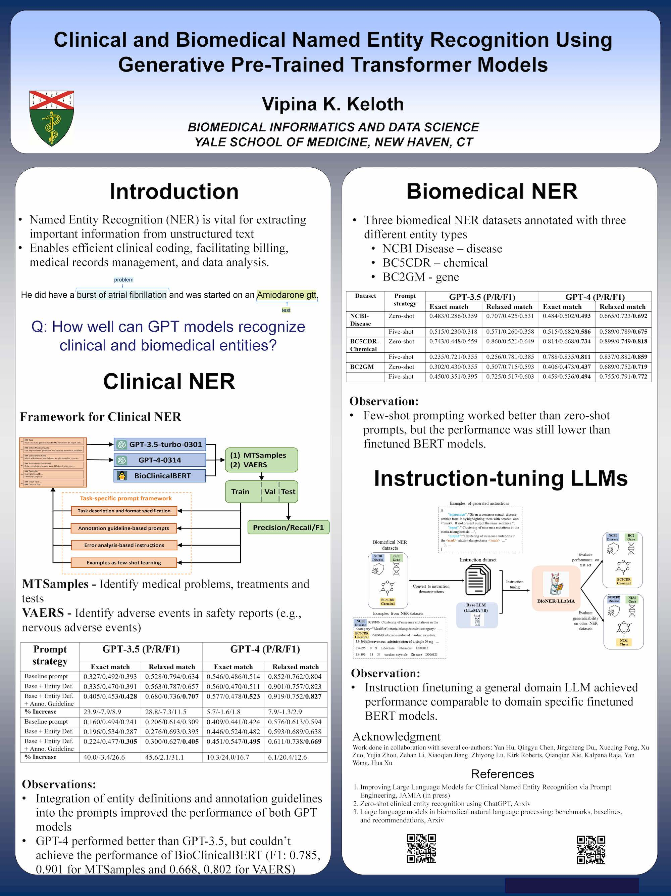

Title: 2024 AI in Medicine Symposium!
Category: news
Date: 2024-02-02
Slug: ai-in-med-symp-presentation
Tags: AI
Summary: Join our groundbreaking symposium for medical professionals and technology enthusiasts! Are you eager to explore the cutting-edge intersection of artificial intelligence and medicine? 🧬 🤖 The symposium is open to all members of the Yale community.

Discover how AI is transforming biomedical imaging, NLP, clinical applications, bioinformatics, and more. Engage in dynamic lightning talks, panel discussions, and a poster session that will enrich your understanding and network in the realm of medical AI. For more information, visit [https://medicine.yale.edu/event/inaugural-ai-in-medicine-symposium-at-ysm/](https://medicine.yale.edu/event/inaugural-ai-in-medicine-symposium-at-ysm/).

Dr. Xu attended the panel discussion titled "Generative AI in Medical Education, Basic Science, and Clinical Practice."

<iframe width="560" height="315" src="https://www.youtube.com/embed/3Lk8BvpA1ic?si=IMl50X4BCgYyw3Z-" title="YouTube video player" frameborder="0" allow="accelerometer; autoplay; clipboard-write; encrypted-media; gyroscope; picture-in-picture; web-share" allowfullscreen></iframe>

 
 

Our lab members presented the following oral presentations and posters.

- Rethink Biomedical Literature Search and Visualization in the Era of Large Language Models – A Prototype Development. Huan He, PhD

<iframe width="560" height="315" src="https://www.youtube.com/embed/HT-isv6FJuM?si=aCJOHTMnubgKQvlo" title="YouTube video player" frameborder="0" allow="accelerometer; autoplay; clipboard-write; encrypted-media; gyroscope; picture-in-picture; web-share" allowfullscreen></iframe>

 
 

- Me LLaMA: A Suite of Large Language Models, Datasets, and Tools for Medical Application. Qianqian Xie, PhD

<iframe width="560" height="315" src="https://www.youtube.com/embed/Z41qeL9Dzq4?si=praLd80FeVxXZHMv" title="YouTube video player" frameborder="0" allow="accelerometer; autoplay; clipboard-write; encrypted-media; gyroscope; picture-in-picture; web-share" allowfullscreen></iframe>

 
 

- Clinical and Biomedical Named Entity Recognition Using Generative Pre-Trained Transformer Models. 
Vipina Keloth, PhD

 
 

- Beyond Result Reporting on the Testing Set: Enhancing AI-Assisted Medical Imaging Diagnostic Workflow, External Validations, and Continued Training. Qingyu Chen, PhD

 
 

- A Systematic Evaluation of Large Language Models for Biomedical Natural Language Processing: Benchmarks, Baselines, and Recommendations. Qingyu Chen, PhD

