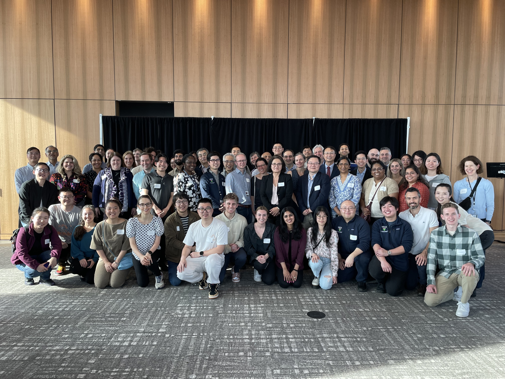

Title: Introducing the Department of Biomedical Informatics and Data Science!
Category: news
Date: 2024-05-08
Slug: bids-becomes-department
Tags: BIDS
Summary: Our humble section has completed its official transition to a department within the Yale School of Medicine!

At a lavish reception on the 14th floor of Kline Tower at Yale, we celebrated the official transition of our home academic unit, Biomedical Informatics and Data Science, from a section to a department within the Yale School of Medicine. BIDS has experienced rapid, exciting growth in less than a year and a half and continues to display immense potential under the stewardship of our chair Lucila Ohno-Machado.

<figure><figcaption>The new Department of Biomedical Informatics and Data Science.</figcaption></figure>
<figure><figcaption>Xu Lab in attendance at the reception!</figcaption></figure>