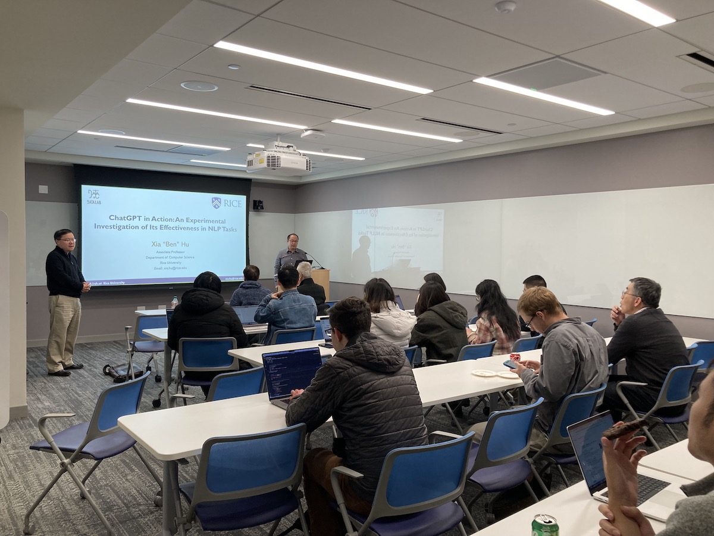

Title: The Third Meeting of the Yale NLP LLM Interest Group
Category: news
Date: 2024-03-20
Slug: third-nlp-llm-ig
Tags: NLP,LLM
Summary: "ChatGPT in Action: An Experimental Investigation of Its Effectiveness in NLP Tasks" by Dr. Xia "Ben" Hu

**Speaker**: Dr. Xia “Ben” Hu, Associate Professor, Department of Computer Science at Rice University.

**Title of Talk**: ChatGPT in Action: An Experimental Investigation of Its Effectiveness in NLP Tasks 

**When**: Wednesday, March 20, 4:30-5:30 p.m.

**Location**: 100 College Street, 11th Floor, Workshop 1167

### Speaker bio:

Dr. Xia “Ben” Hu is an Associate Professor at Rice University in the Department of Computer Science. Dr. Hu has published over 200 papers in several major academic venues, including NeurIPS, ICLR, KDD, WWW, IJCAI, AAAI, etc. An open-source package developed by his group, namely AutoKeras, has become the most used automated deep learning system on Github (with over 8,000 stars and 1,000 forks). Also, his work on deep collaborative filtering, anomaly detection and knowledge graphs have been included in the TensorFlow package, Apple production system and Bing production system, respectively. His papers have received ten Best Paper (Candidate) awards from venues such as ICML, WWW, WSDM, ICDM, AMIA and INFORMS. He is the recipient of NSF CAREER Award and ACM SIGKDD Rising Star Award. His work has been cited more than 20,000 times with an h-index of 60. He is the conference General Co-Chair for WSDM 2020 and ICHI 2023. He is also the founder of AI POW LLC.

### Get Involved!

We invite all members to actively participate in the activities of the Yale NLP LLM Interest Group. Whether you're a seasoned NLP practitioner or just starting to explore the field, there's a place for you in our community. Stay tuned for updates on upcoming events and initiatives!
Join our **mailing list [https://mailman.yale.edu/mailman/listinfo/nlp-llm-ig](https://mailman.yale.edu/mailman/listinfo/nlp-llm-ig)** to stay informed about future meetings and events.
