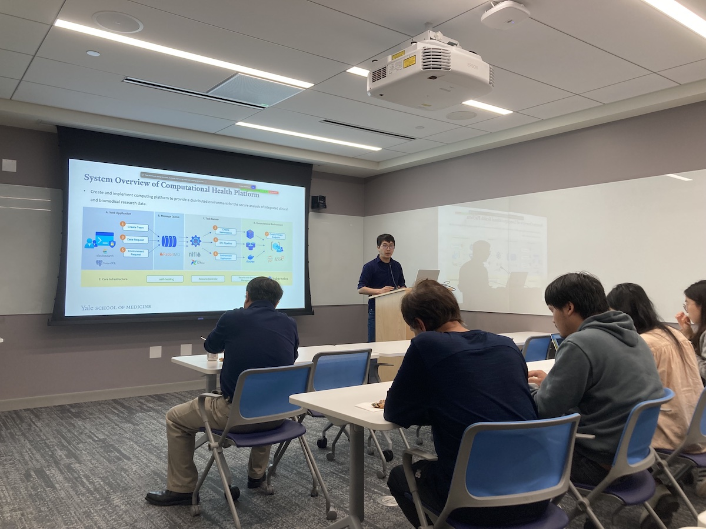

Title: Eighth Meeting of the Yale NLP/LLM Interest Group
Category: nlp-llm-ig
Date: 2024-05-29
Slug: eighth-nlp-llm-ig
Tags: NLP,LLM
Summary: "Kamino: A Scalable Architecture to Support Medical AI Research Using Large Real-World Data" by Dr. Fongci Lin

**Speaker**: Dr. Fongci Lin, Associate Research Scientist in Biomedical Informatics and Data Science

**Title of Talk**: Kamino: A Scalable Architecture to Support Medical AI Research Using Large Real-World Data

**When**: Wednesday, May 29, 4:30-5:30 p.m.

**Location**: 100 College Street, 11th Floor, Workshop 1167

**Recording Link**: <https://www.youtube.com/watch?v=KUIqyXQXMEY>

### Speaker bio:

Electronic Health Records (EHRs) represent a crucial data source for real-world evidence generation. To facilitate biomedical studies using EHRs, standard data models like the OMOP CDM have been developed. Nevertheless, recent advancements in biomedical AI research that leverage EHRs have introduced new challenges, encompassing security considerations, large-scale data retrieval, and computational resource management, including GPUs. This paper introduces Kamino, an innovative architectural solution tailored to support biomedical AI research using EHR data. Kamino offers a user-friendly interface with features designed for efficient team access management in accordance with regulatory requirements. It facilitates direct data retrieval from an OMOP CDM instance and includes a resource allocation system based on Kubernetes orchestration. Here, we demonstrate the practical application and utility of Kamino through a clinical natural language processing task. We firmly believe that such a tool will significantly expedite AI research conducted with EHR data within academic institutions.
 

### Get Involved!

We invite all members to actively participate in the activities of the Yale NLP/LLM Interest Group. Whether you're a seasoned NLP practitioner or just starting to explore the field, there's a place for you in our community. Stay tuned for updates on upcoming events and initiatives!
[**Join our mailing list**](https://mailman.yale.edu/mailman/listinfo/nlp-llm-ig) to stay informed about future meetings and events.
