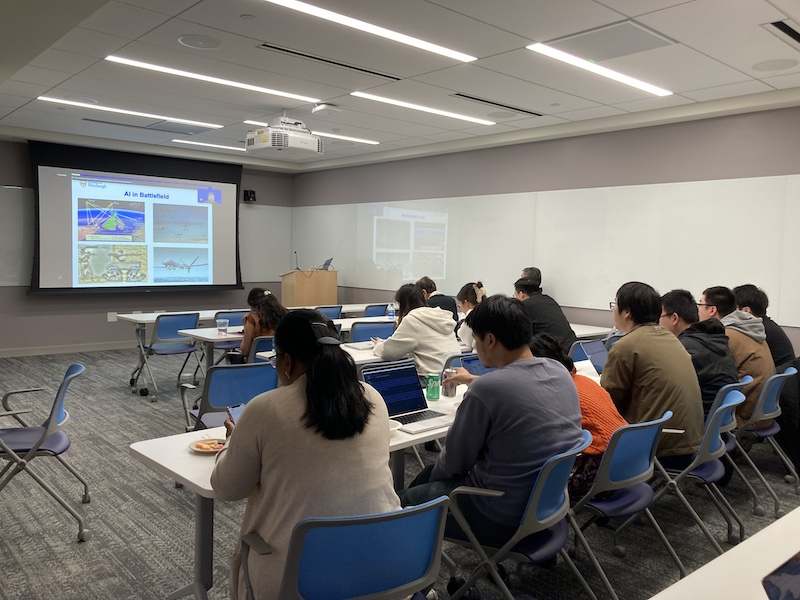

Title: Fifth Meeting of the Yale NLP/LLM Interest Group
Category: nlp-llm-ig
Date: 2024-04-17
Slug: fifth-nlp-llm-ig
Tags: NLP,LLM
Summary: "'GREAT PLEA': Ethical Principles for Adopting Generative AI in Healthcare" by Dr. Yanshan Wang

**Speaker**: Dr. Yanshan Wang, Assistant Professor, Department of Health Information Management, University of Pittsburgh

**Title of Talk**: 'GREAT PLEA': Ethical Principles for Adopting Generative AI in Healthcare

**When**: Wednesday, April 17, 4:30-5:30 p.m.

**Location**: 100 College Street, 11th Floor, Workshop 1167

### Speaker bio:

Dr. Yanshan Wang is vice chair of research and assistant professor within the Department of Health Informatics. Before joining Pitt, Dr. Wang was assistant professor in the Department of AI & Informatics at Mayo Clinic. Dr. Wang has served as PI on multiple awards, and led several NIH-funded projects, which aimed to develop NLP and AI algorithms for EHR information extraction and automation. 

Dr. Wang is also the Fellow of American Medical Informatics Association AMIA, the current Chair of the AMIA NLP Working Group, and the NLP Lead of the National Center for Advancing Translational Sciences Accrual to Clinical Trails Network. 

He has been actively serving the informatics and NLP communities, including the AMIA Annual Symposium, MedInfo, and many other international conferences and journals.

### Get Involved!

We invite all members to actively participate in the activities of the Yale NLP/LLM Interest Group. Whether you're a seasoned NLP practitioner or just starting to explore the field, there's a place for you in our community. Stay tuned for updates on upcoming events and initiatives!
[**Join our mailing list**](https://mailman.yale.edu/mailman/listinfo/nlp-llm-ig) to stay informed about future meetings and events.
