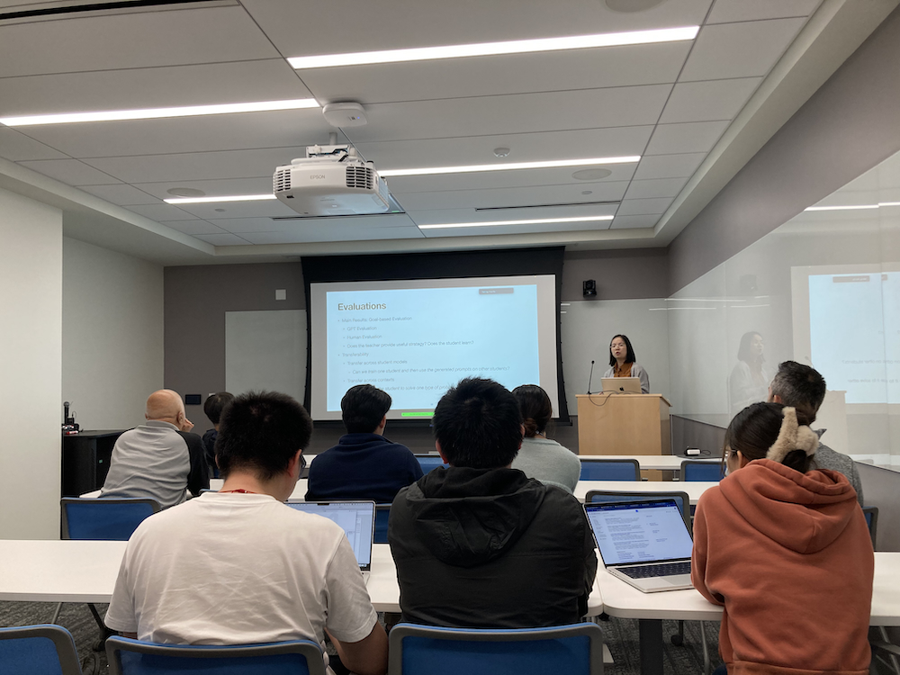
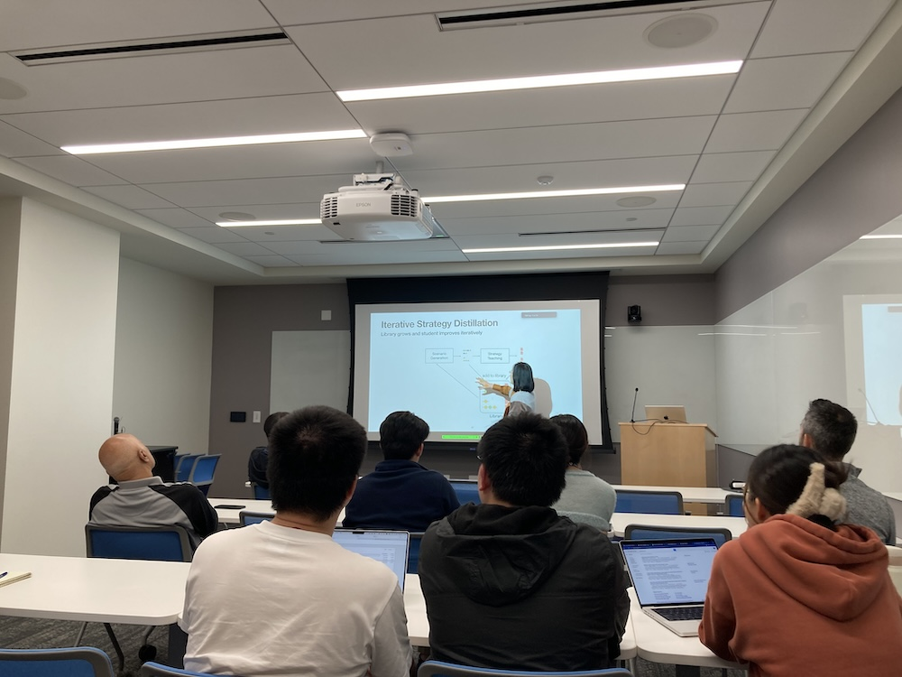

Title: Sixth Meeting of the Yale NLP/LLM Interest Group
Category: nlp-llm-ig
Date: 2024-05-01
Slug: sixth-nlp-llm-ig
Tags: NLP,LLM
Summary: "Strategy Imitation via Prompt Generation without Parameter Tuning" by Dr. Tong Wang

**Speaker**: Dr. Tong Wang, PhD, Assistant Professor, Department of Marketing, Yale University School of Management

**Title of Talk**: Strategy Imitation via Prompt Generation without Parameter Tuning

**When**: Wednesday, May 1, 4:30-5:30 p.m.

**Location**: 100 College Street, 11th Floor, Workshop 1167

**Recording Link**: <https://www.youtube.com/watch?v=VNn2DeKlcGc>

### Speaker bio:

Dr. Tong Wang’s research interests are in developing machine learning solutions for business problems. Her work focuses on creating novel interpretable models that can effectively represent and analyze structured and unstructured data, such as texts and images. The overarching objective of these interpretable models is to extract valuable insights from the data, empowering stakeholders to make well-informed decisions while also facilitating a clear understanding of the decision-making processes employed by the models.
 
Tong received her Ph.D. in Computer Science from Massachusetts Institute of Technology. Prior to joining Yale, she actively pursued research on machine learning solutions for various real-world challenges. Her work on crime pattern detection has been included in Wikipedia Crime Analysis and gained media coverage. The ideas from her algorithm have been implemented by New York Police Department. Tong contributed to the development of an interpretable model for the FICO challenge in 2018, outperforming black-box machine learning models and earning the FICO Recognition Award.
 

### Get Involved!

We invite all members to actively participate in the activities of the Yale NLP/LLM Interest Group. Whether you're a seasoned NLP practitioner or just starting to explore the field, there's a place for you in our community. Stay tuned for updates on upcoming events and initiatives!
[**Join our mailing list**](https://mailman.yale.edu/mailman/listinfo/nlp-llm-ig) to stay informed about future meetings and events.
