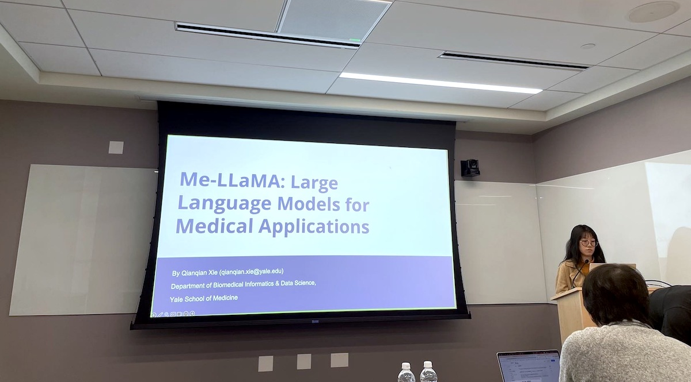

Title: Seventh Meeting of the Yale NLP/LLM Interest Group
Category: nlp-llm-ig
Date: 2024-05-15
Slug: seventh-nlp-llm-ig
Tags: NLP,LLM
Summary: "Me LLaMA: Foundation Large Language Models for Medical Applications" by Dr. Qianqian Xie

**Speaker**: Dr. Qianqian Xie, PhD, Postdoctoral Associate in Biomedical Informatics and Data Science

**Title of Talk**: Me LLaMA: Foundation Large Language Models for Medical Applications

**When**: Wednesday, May 15, 4:30-5:30 p.m.

**Location**: 100 College Street, 11th Floor, Workshop 1167

**Recording Link**: *Coming soon*

### Speaker bio:

Dr. Qianqian Xie is a Postdoctoral Associate at the Section of Biomedical Informatics and Data Science, School of Medicine, Yale University. Her research interests are natural language processing and its application in medicine. She has co-authored more than 50 peer-reviewed publications. Her research has been published in leading conferences and journals, such as ACL, KDD, EMNLP, NAACL, COLING, BioNLP, WWW, ICDM, TOIS, TKDE, IEEE JBHI, Bioinformatics, JBI, among others.
 

### Get Involved!

We invite all members to actively participate in the activities of the Yale NLP/LLM Interest Group. Whether you're a seasoned NLP practitioner or just starting to explore the field, there's a place for you in our community. Stay tuned for updates on upcoming events and initiatives!
[**Join our mailing list**](https://mailman.yale.edu/mailman/listinfo/nlp-llm-ig) to stay informed about future meetings and events.
