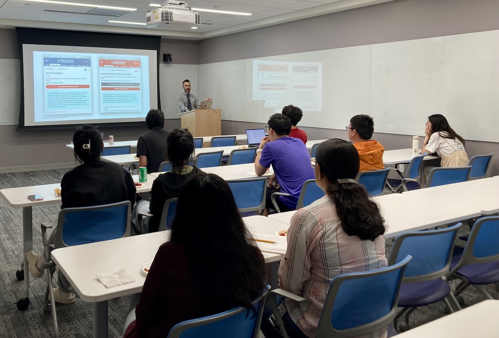

Title: Ninth Meeting of the Yale NLP/LLM Interest Group
Category: nlp-llm-ig
Date: 2024-06-12
Slug: ninth-nlp-llm-ig
Tags: NLP,LLM
Summary: "Give it to Me Straight, Doc: Rewriting Biomedical Abstracts in Plain Language with LLMs" by Dr. Brian Ondov

**Speaker**: Brian Ondov, PhD, Associate Research Scientist in Biomedical Informatics and Data Science

**Title of Talk**: Give it to Me Straight, Doc: Rewriting Biomedical Abstracts in Plain Language with LLMs

**When**: Wednesday, June 12, 4:30-5:30 p.m.

**Location**: 100 College Street, 11th Floor, Workshop 1167

**Recording Link**: *Coming soon*

### Speaker bio:

Lack of health literacy drives socioeconomic disparities in outcomes and makes truly informed consent unrealistic. At the same time, there has never been more information available to patients' and caregivers' fingertips. How do we bridge this gap? In this work, we investigate whether Large Language Models (LLMs) can automatically rewrite biomedical abstracts in plain language, with the aim of helping healthcare consumers stay informed about the latest research from trusted sources. First, I will describe the creation of a high-quality dataset written by contracted science writers. Next,  I will present the results of a shared task we hosted, including our own zero-shot GPT-3.5-based baseline, which scored highest in manual evaluation. I will then discuss our efforts to fine-tune open-source LLMs for this task. Finally, I describe ongoing work on testing the efficacy of rewritten abstracts, by using Masked Language Models to create cloze-style reading comprehension tests.

### Get Involved!

We invite all members to actively participate in the activities of the Yale NLP/LLM Interest Group. Whether you're a seasoned NLP practitioner or just starting to explore the field, there's a place for you in our community. Stay tuned for updates on upcoming events and initiatives!
[**Join our mailing list**](https://mailman.yale.edu/mailman/listinfo/nlp-llm-ig) to stay informed about future meetings and events.
