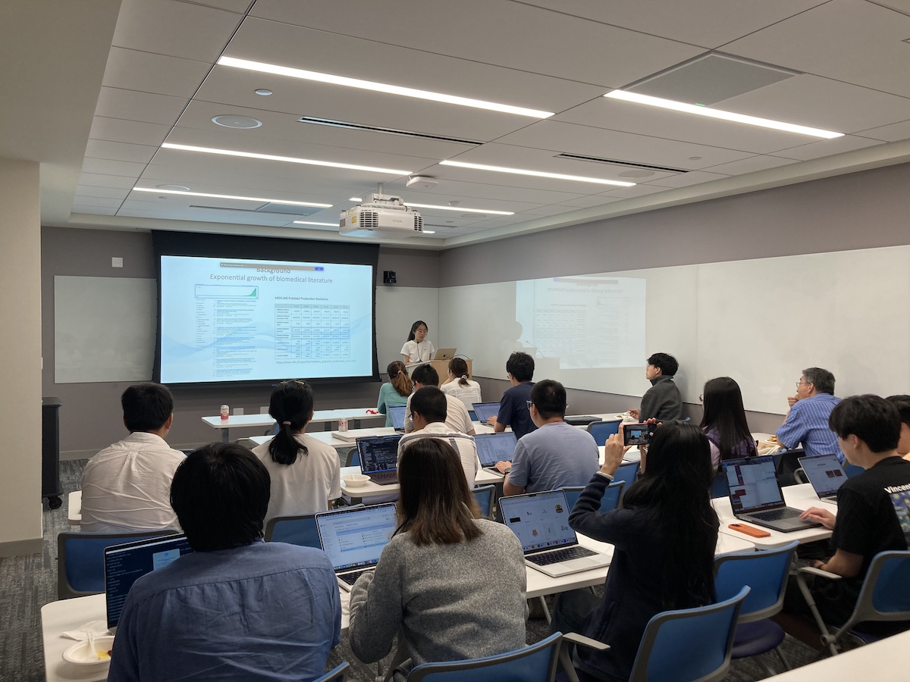

Title: Eleventh Meeting of the Yale NLP/LLM Interest Group
Category: nlp-llm-ig
Date: 2024-07-10
Slug: eleventh-nlp-llm-ig
Tags: NLP,LLM
Summary: "A New Approach to Detecting Semantic Novelty of Biomedical Literature" by Dr. Xueqing Peng

**Speaker**: Xueqing Peng, PhD, Postdoctoral Associate in Biomedical Informatics and Data Science

**Title of Talk**: A New Approach to Detecting Semantic Novelty of Biomedical Literature

**When**: Wednesday, July 10, 4:30-5:30 p.m.

**Location**: 100 College Street, 11th Floor, Workshop 1167

**Recording Link**: <https://www.youtube.com/watch?v=gXVGpn00uCI>

### Speaker bio:

Identifying novel research work is a significant challenge in the rapidly evolving field of biomedical research. We propose a novel approach to assess the semantic novelty of scientific publications by leveraging recent LLM-based text embedding models. Using the text of publications, such as titles and abstracts, we build a "semantic universe" that maps the landscape of biomedical scientific knowledge, letting us measure the semantic novelty of each article based on its text embedding.

To evaluate our approach, we examined its correlations with other measurements, such as citation count and other relevant metrics. Additionally, we explored its potential applications in visualizing the evolution of research fields over time and recognizing breakthrough research, such as Nobel Prize-winning work. We believe that our approach can serve as a valuable tool to assist researchers in exploring new areas, provide deeper insights to funding agencies when considering proposals, and offer publishers an additional perspective in evaluating research.

### Get Involved!

We invite all members to actively participate in the activities of the Yale NLP/LLM Interest Group. Whether you're a seasoned NLP practitioner or just starting to explore the field, there's a place for you in our community. Stay tuned for updates on upcoming events and initiatives!
[**Join our mailing list**](https://mailman.yale.edu/mailman/listinfo/nlp-llm-ig) to stay informed about future meetings and events.
