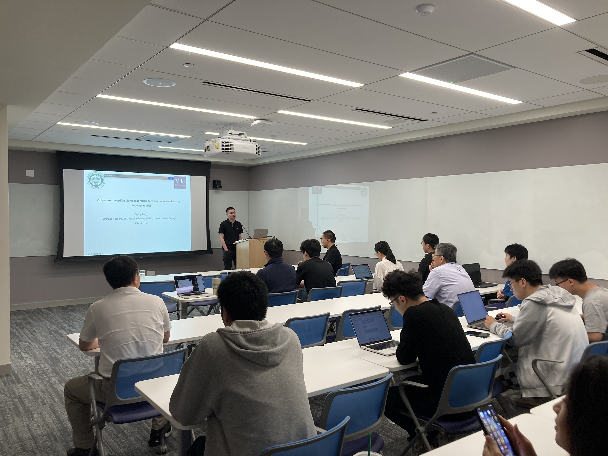

Title: Twelfth Meeting of the Yale NLP/LLM Interest Group
Category: nlp-llm-ig
Date: 2024-07-19
Slug: twelfth-nlp-llm-ig
Tags: NLP,LLM
Summary: "Outpatient reception via collaboration between nurses and a large language model" by Dr. Erping Long

**Speaker**: Erping Long, PhD, Assistant Professor in the Chinese Academy of Medical Sciences & Peking Union Medical College

**Title of Talk**: A New Approach to Detecting Semantic Novelty of Biomedical Literature

**When**: Friday, July 19, 11:00am-12:00 p.m.

**Location**: 100 College Street, 11th Floor, Workshop 1167

**Recording Link**: <https://www.youtube.com/watch?v=yZh_6NrQs8g>

### Speaker bio:

Reception is an essential process for patients seeking medical care and a critical component influencing the healthcare experience. Addressing patients' concerns and easing their anxiety is the primary objective of receptionist nurses. However, current communication system mainly relied on efforts of human, which is labor and knowledge dual-intense, resulting in frequent burn-out and compromised patient experience. An attractive alternative is to leverage the capabilities of large language models (LLMs) to assist the communication in reception sites of medical centers. Yet, several limitations have hindered the deployment of LLMs, including shortage in context-specific knowledge, lack of real-world benchmarks, and model uncertainty. In this study, we curated a unique dataset comprising 35,418 cases of real-world conversation audio corpus between outpatients and receptionist nurses from 10 reception sites across 2 medical centers, to develop SSPEC, a site-specific prompt engineering chatbot. By integrating context-specific real-world knowledge and prompt strategies, SSPEC efficiently resolved patient queries, with a higher proportion of queries addressed in fewer rounds of queries and responses compared to nurse-led sessions.

### Get Involved!

We invite all members to actively participate in the activities of the Yale NLP/LLM Interest Group. Whether you're a seasoned NLP practitioner or just starting to explore the field, there's a place for you in our community. Stay tuned for updates on upcoming events and initiatives!
[**Join our mailing list**](https://mailman.yale.edu/mailman/listinfo/nlp-llm-ig) to stay informed about future meetings and events.
