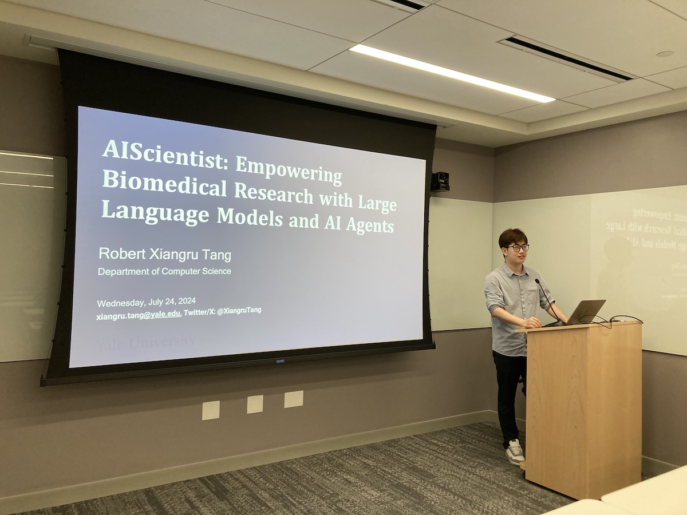

Title: Thirteenth Meeting of the Yale NLP/LLM Interest Group
Category: nlp-llm-ig
Date: 2024-07-24
Slug: thirteenth-nlp-llm-ig
Tags: NLP,LLM
Summary: "Empowering Biomedical Research with Large Language Models and AI Agents" by Robert Tang

**Speaker**: Robert Tang, PhD Student in Computer Science at Yale University

**Title of Talk**: Empowering Biomedical Research with Large Language Models and AI Agents

**When**: Wednesday, July 24, 4:30pm-5:30pm

**Location**: 100 College Street, 11th Floor, Workshop 1167

**Recording Link**: <https://www.youtube.com/watch?v=rxUbC-gz-wI>

### Speaker bio:

We envision "AI scientists" as collaborative agents capable of reasoning and coding that empower biomedical research. I will first demonstrate MedAgents, the first multi-agent framework in the medical field. MedAgents examines how large language models (LLMs) can be used as collaborative experts to enhance medical reasoning through multi-round discussions. Then, I will briefly present our works on benchmarking existing LLMs on bioinformatics code generation and agents on repository-level data science tasks. Finally, while LLMs' capabilities are promising, I will highlight vulnerabilities and potential risks associated with their misuse and emphasize the need for safety measures.

### Get Involved!

We invite all members to actively participate in the activities of the Yale NLP/LLM Interest Group. Whether you're a seasoned NLP practitioner or just starting to explore the field, there's a place for you in our community. Stay tuned for updates on upcoming events and initiatives!
[**Join our mailing list**](https://mailman.yale.edu/mailman/listinfo/nlp-llm-ig) to stay informed about future meetings and events.
