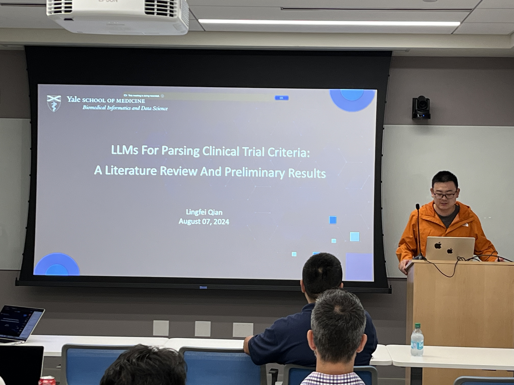

Title: Fourteenth Meeting of the Yale NLP/LLM Interest Group
Category: nlp-llm-ig
Date: 2024-08-07
Slug: fourteenth-nlp-llm-ig
Tags: NLP,LLM
Summary: "LLMs for Parsing Clinical Trial Criteria: A Literature Review and Preliminary Results" by Dr. Lingfei Qian

**Speaker**: Lingfei Qian, PhD, Postdoctoral Associate in Biomedical Informatics and Data Science at Yale University

**Title of Talk**: LLMs for Parsing Clinical Trial Criteria: A Literature Review and Preliminary Results

**When**: Wednesday, August 7, 4:30pm-5:30pm

**Location**: 100 College Street, 11th Floor, Workshop 1167

**Recording Link**: <https://www.youtube.com/watch?v=YbbUGA1r_mI>

### Speaker bio:

Lingfei Qian, PhD, is a Postdoctoral Associate at the Department of Biomedical Informatics and Data Science, Yale School of Medicine. Lingfei graduated with a doctoral degree in Applied Computer Technology from Dalian University of Technology in 2023. Lingfei’s research interests include machine learning, natural language processing (NLP), and medical data analysis, especially EHR data. He is also interested in improving healthcare outcomes through advanced data analysis techniques.

### Get Involved!

We invite all members to actively participate in the activities of the Yale NLP/LLM Interest Group. Whether you're a seasoned NLP practitioner or just starting to explore the field, there's a place for you in our community. Stay tuned for updates on upcoming events and initiatives!
[**Join our mailing list**](https://mailman.yale.edu/mailman/listinfo/nlp-llm-ig) to stay informed about future meetings and events.
