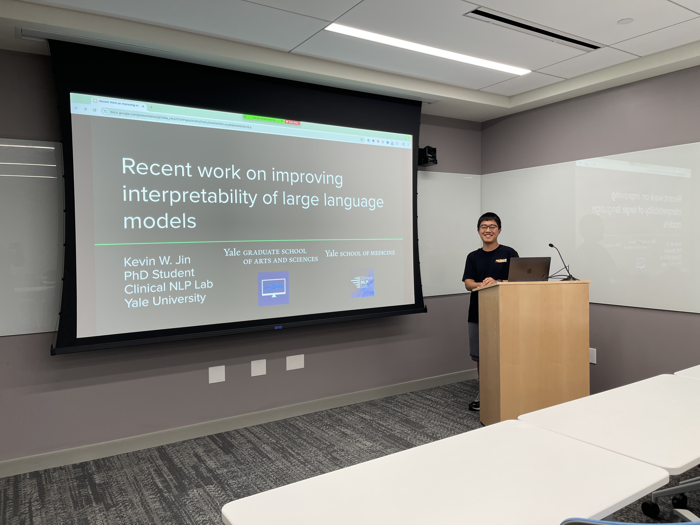
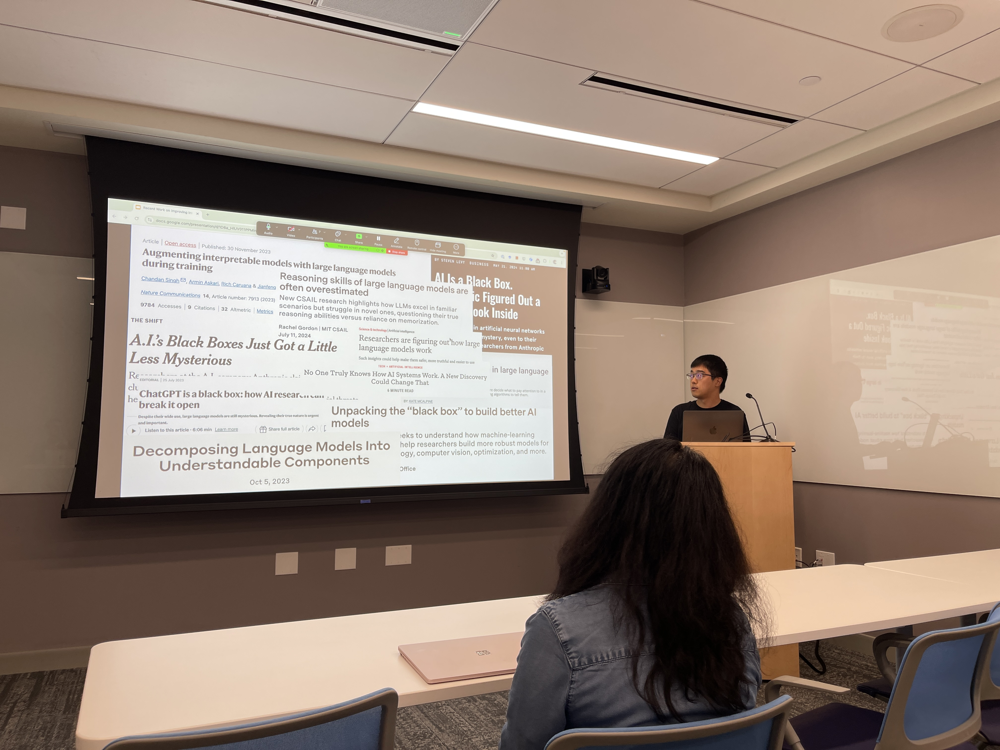
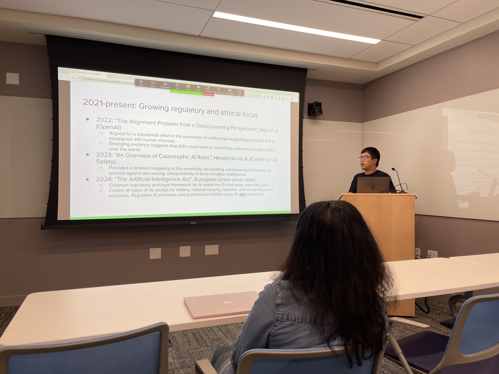

Title: Seventeenth Meeting of the Yale NLP/LLM Interest Group
Category: nlp-llm-ig
Date: 2024-09-19
Slug: seventeenth-nlp-llm-ig
Tags: NLP,LLM
Summary: "Recent work on improving interpretability of large language models" by Kevin Jin

**Speaker**: Kevin Jin, Ph.D. Student in Computational Biology and Biomedical Informatics at Yale University

**Title of Talk**: Recent work on improving interpretability of large language models

**When**: Thursday, September 19, 4:30pm-5:30pm

**Location**: 100 College Street, 11th Floor, Workshop 1167

**Recording Link**: <https://www.youtube.com/watch?v=SA9NbWeHbQs>

### Talk summary:

Rarely are the inner workings of one’s computer or automobile considered by most, since utility is prized over transparency. Large language models (LLMs) have defined the frontier of artificial intelligence and vaulted it into public consciousness, with their impressive capabilities inspiring myriad applications. But much of the reasoning behind their behavior, both beneficial and harmful, remains unknown. Uncovering the black box of LLMs is a crucial pursuit that can help mitigate, build trust, ensure safety and compliance, and drive further innovation. This talk will motivate interpretability of LLMs, place the ongoing push for interpretability in historical context, and cover three recent papers that advance our mechanistic understanding of LLMs.

### Speaker bio:

Kevin Jin is a second-year PhD student in the interdepartmental program in Computational Biology and Biomedical Informatics at Yale University. He is a member of the Clinical NLP Lab, a group in the Department of Biomedical Informatics and Data Science at the Yale School of Medicine, and advised by Hua Xu. His research interests are diversely distributed but concentrate on digital psychiatry: characterizing mental health disorders with natural language processing and wearable biosensors. Kevin completed his undergraduate work at Johns Hopkins University, receiving a B.S. in Molecular and Cellular Biology in 2020, and subsequently underwent a career transition from pre-med to biomedical informatics. Outside of the lab, he loves reading news, studying languages, baking desserts, and sparring at the Yale Kendo Club.

### Get Involved!

We invite all members to actively participate in the activities of the Yale NLP/LLM Interest Group. Whether you're a seasoned NLP practitioner or just starting to explore the field, there's a place for you in our community. Stay tuned for updates on upcoming events and initiatives!
[**Join our mailing list**](https://mailman.yale.edu/mailman/listinfo/nlp-llm-ig) to stay informed about future meetings and events.
